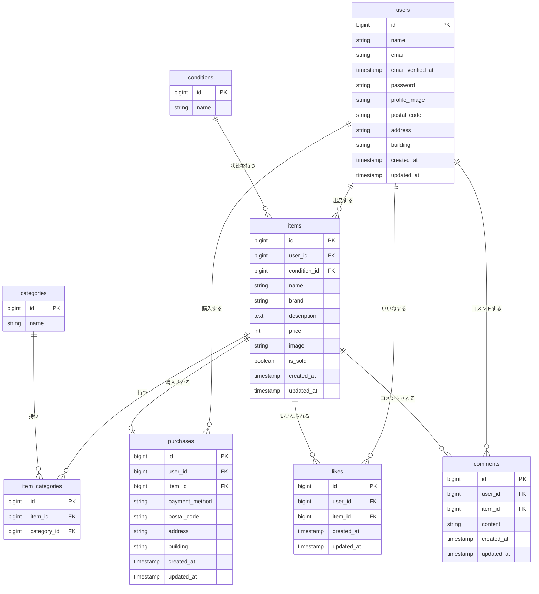

# coachtechフリマ

## アプリケーション概要

フリマアプリ。アイテムの出品・購入・いいね・コメント機能を備えた Web アプリケーションです。

## 使用技術

| 技術           | バージョン    |
| -------------- | ------------- |
| PHP            | 8.2           |
| Laravel        | 10.x          |
| MySQL          | 8.0           |
| nginx          | 1.25          |
| Docker         | 25.x 以上推奨 |
| docker-compose | 2.x 以上推奨  |

## URL

| サービス              | URL                   |
| --------------------- | --------------------- |
| アプリケーション      | http://localhost      |
| phpMyAdmin            | http://localhost:8080 |
| MailHog（メール確認） | http://localhost:8025 |

## 環境構築手順

### 1. リポジトリをクローン

```bash
git clone <https://github.com/yuto9990720/coachtech-free-market-app.git>
cd coachtech-flea-market
```

### 2. 環境変数ファイルを作成

```bash
cp src/.env.example src/.env
```

### 3. Stripe キーを設定（応用要件・決済機能）

`src/.env` を開き、取得した Stripe テストキーを設定します。

```
STRIPE_KEY=pk_test_xxxxxxxxxxxxxxxx
STRIPE_SECRET=sk_test_xxxxxxxxxxxxxxxx
```

### 4. Docker コンテナを起動

```bash
docker-compose up -d --build
```

### 5. PHP コンテナに入る

```bash
docker-compose exec php bash
```

### 6. 以降の操作はコンテナ内で実行

```bash
# Composer パッケージインストール
composer install

# アプリケーションキー生成
php artisan key:generate

# ストレージリンク作成
php artisan storage:link

# マイグレーション実行
php artisan migrate

# ダミーデータ投入
php artisan db:seed
```

### 7. ブラウザで確認

http://localhost にアクセスして動作を確認してください。

---

## テスト実行

```bash
# コンテナ内で実行
docker-compose exec php bash
php artisan test
```

または個別テストスイートの実行：

```bash
php artisan test --testsuite=Feature
php artisan test --filter RegisterTest
php artisan test --filter LoginTest
```

---

## テストアカウント

シーダー実行後、以下のアカウントでログインできます。

| メールアドレス    | パスワード | 説明                             |
| ----------------- | ---------- | -------------------------------- |
| test1@example.com | password   | テストユーザー1（商品1〜5出品）  |
| test2@example.com | password   | テストユーザー2（商品6〜10出品） |

---

## ER図



## 主な機能

### 基本機能

- 会員登録・ログイン・ログアウト（Laravel Fortify）
- 商品一覧表示（全商品 / マイリスト タブ切り替え）
- 商品名での部分一致検索
- 商品詳細表示
- いいね機能（Ajax）
- コメント送信機能
- 商品出品機能（画像アップロード）
- 商品購入機能
- 配送先住所変更機能
- プロフィール表示・編集

### 応用機能

- メール認証（MailHog）
- Stripe 決済（コンビニ払い・カード払い）

---

## ディレクトリ構成

```
coachtech-flea-market/
├── docker/
│   ├── nginx/default.conf
│   ├── php/Dockerfile, php.ini
│   └── mysql/my.cnf
├── src/                        # Laravel プロジェクト
│   ├── app/
│   │   ├── Http/
│   │   │   ├── Controllers/    # 各コントローラー
│   │   │   └── Requests/       # FormRequest バリデーション
│   │   ├── Models/             # Eloquent モデル
│   │   └── Providers/          # サービスプロバイダー
│   ├── database/
│   │   ├── migrations/         # マイグレーション（9テーブル）
│   │   ├── seeders/            # シーダー
│   │   └── factories/          # ファクトリ
│   ├── resources/
│   │   ├── views/              # Blade テンプレート
│   │   └── css/app.css         # スタイルシート
│   ├── routes/web.php
│   └── tests/Feature/          # PHPUnit テスト
└── docker-compose.yml
```
